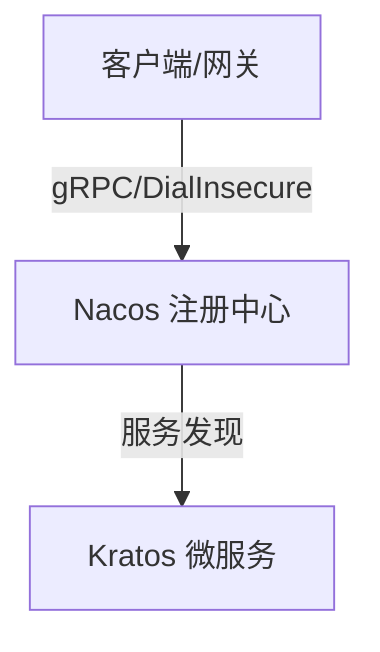

<%*
// 1. 标题与重命名 
let title = await tp.system.prompt("请输入笔记标题:"); if (title) { await tp.file.rename(title); } else { title = tp.file.title; } tp.title = title;

// 2. 内容类型 
let tech = await tp.system.suggester( ["工具", "微服务", "云原生", "设施", "语言", "算法", "数据库", "中间件", "安全"], ["Tool", "Microservices", "CloudNative", "Infra", "Lang", "Algorithm", "Database", "Middleware", "Security"] ); tp.tech = tech || "Lang";

// 3. 难度评级
let priority = await tp.system.suggester(["⭐ 简单", "⭐⭐ 中等", "⭐⭐⭐ 困难"], ["Lv1", "Lv2", "Lv3"]); tp.priority = priority || "Lv2";

-%>
---
tags:
  - status/growing
  - tech/<% tp.tech %>
  - priority/<% tp.priority %>
aliases: []
date: <% tp.file.creation_date("YYYY-MM-DD HH:mm") %>
updated: <% tp.date.now("YYYY-MM-DD HH:mm") %>
deck: Note::<% tp.tech %>

---
# <% tp.title %>

> [!abstract] 场景与痛点 (Why)
> - **核心诉求：** 填入解决什么问题、应对什么业务场景
> - **前置上下文：** 填入依赖的服务或基础设施版本

---

## 核心架构 / 机制 (How)



### 生产环境约束与踩坑点
- [ ] **服务发现：**
- [ ] **资源限制：** 

---

## 配置与核心代码 (Code)

> [!tip] 最小复现环境
> - 运行命令：`TODO`
> - 版本信息：`TODO`

```go
package main

import "fmt"

func main() {
    // TODO: 完善业务逻辑
    fmt.Println("System initialized.")
}
```

---

## 记忆卡
START
填空题
文字: 本笔记的核心机制是什么？
背面额外: TODO
END


#### 核心机制是什么？ 
TODO：用一句话写出本笔记核心机制。

---

## 延伸阅读
* **归属主题索引：** [[微服务架构MOC]] / [[云原生基础设施]]
* **参考文档：**
