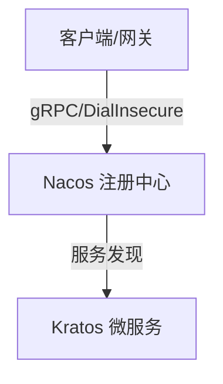

<%*
// 1. 弹窗输入标题
let noteTitle = await tp.system.prompt("请输入笔记的技术主题:");
if (noteTitle) {
    await tp.file.rename(noteTitle);
} else {
	noteTitle = tp.file.title;
}

// 2. 弹窗下拉选择 Anki 牌组 (极客专属)
// 前一个中括号是“显示给你的选项”，后一个中括号是“真正写入的 Anki 牌组名”
let deckName = await tp.system.suggester(
    [
	    "💻 后端微服务 (Backend)", 
	    "☁️ 云原生与基建 (CloudNative)", 
	    "🛠️ Go语言底层 (Golang)", 
	    "📝 通用默认 (Default)",
	],
    [
	    "ComputerScience::Backend", 
	    "ComputerScience::CloudNative", 
	    "ComputerScience::Golang", 
	    "ComputerScience::Default",
	]
);

// 如果你直接按 ESC 没选，给一个兜底的默认值
if (!deckName) {
    deckName = "ComputerScience::Default";
}

// 3. 【核心黑科技】将选择的牌组名挂载到 tp 全局对象上，供正文读取
tp.custom_deck = deckName;
-%>
---
tags:
  - tech/growing
  - status/review
date: <% tp.file.creation_date("YYYY-MM-DD HH:mm") %>
anki-deck: <% tp.custom_deck %>
---
# <% noteTitle %>

> [!abstract] 场景与痛点 (Why)
> - **核心诉求：** 填入解决什么问题、应对什么业务场景
> - **前置上下文：** 填入依赖的服务或基础设施版本

---

## 核心架构 / 机制 (How)



### 生产环境约束与踩坑点
- [ ] **服务发现：** 
- [ ] **资源限制：**

## 配置与核心代码 (Code)

```go
package main

import "fmt"

func main() {
    // TODO: 完善业务逻辑
    fmt.Println("System initialized.")
}
```

---

## Anki 记忆卡片

> [!info] Anki 卡片配置区
> TARGET DECK: <% tp.custom_deck %>
> START
> Cloze
> 关于 **<% noteTitle %>**，其核心配置/核心机制的关键在于：{==填入核心记忆点==}。
> FILE: <% noteTitle %>
> END

---

## 延伸阅读
* **归属主题索引：** [[微服务架构MOC]] / [[云原生基础设施]]
* **参考文档：** 