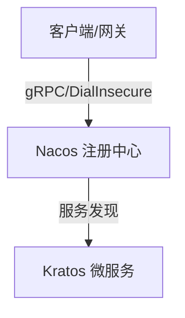

<%*
// 1. 标题与重命名 
let noteTitle = await tp.system.prompt("请输入笔记的技术主题:"); if (noteTitle) { await tp.file.rename(noteTitle); } else { noteTitle = tp.file.title; } tp.user_title = noteTitle;

// 2. 牌组选择 
let deckName = await tp.system.suggester( ["💻 后端微服务", "☁️ 云原生", "🛠️ Go语言底层"], ["ComputerScience::Backend", "ComputerScience::CloudNative", "ComputerScience::Golang"] ); tp.user_deck = deckName || "ComputerScience::Backend";

// 3. 难度评级 (用于同步到 Anki 的 Tag，辅助复习) 
let difficulty = await tp.system.suggester(["⭐ 简单", "⭐⭐ 中等", "⭐⭐⭐ 困难"], ["Lv1", "Lv2", "Lv3"]); tp.user_diff = difficulty || "Lv2";

-%>
---
tags:
  - tech/growing
  - status/review
  - <% tp.user_diff %>
date: <% tp.file.creation_date("YYYY-MM-DD HH:mm") %>
anki-deck: <% tp.user_deck %>

---
# <% tp.user_title %>

> [!abstract] 场景与痛点 (Why)
> - **核心诉求：** 填入解决什么问题、应对什么业务场景
> - **前置上下文：** 填入依赖的服务或基础设施版本

---

## 核心架构 / 机制 (How)



### 生产环境约束与踩坑点
- [ ] **服务发现：**
- [ ] **资源限制：** 

---

## 配置与核心代码 (Code)

```go
package main

import "fmt"

func main() {
    // TODO: 完善业务逻辑
    fmt.Println("System initialized.")
}
```

---

## 记忆卡

TARGET DECK: <% tp.user_deck %> 
START 
填空题 
1. 关于 **<% tp.user_title %>**，其核心机制在于：{{c1::填入核心机制}}。 
2. 当出现 {{c2::异常场景}} 时，系统表现为 {{c3::现象描述}}。 
FILE: <% tp.user_title %> 
END 

START 
问答题 
Front: <% tp.user_title %> 的核心用途是什么？ 
Back:
END

---

## 延伸阅读
* **归属主题索引：** [[微服务架构MOC]] / [[云原生基础设施]]
* **参考文档：**