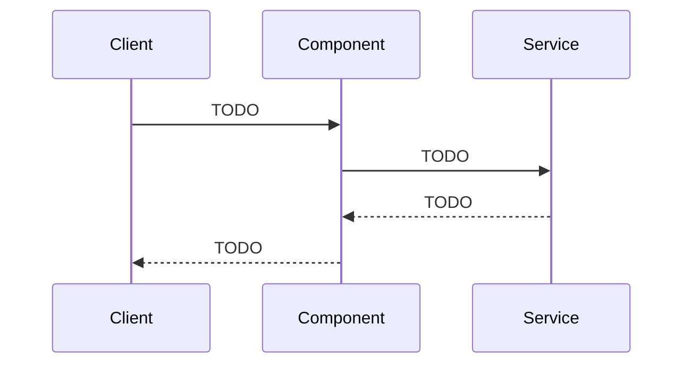

<%*
await tp.user.note_base.setupTitle(tp, "请输入组件或框架名称:");
await tp.user.note_base.chooseTopic(tp, "Architecture");
await tp.user.note_base.choosePriority(tp);
await tp.user.note_base.chooseStatus(tp);
tR += tp.user.note_base.renderFrontmatter(tp, "component");
-%>
# <% tp.title %>

## 摘要
> [!tip] 快速说明组件定位和工程价值。

- **一句话定位：** TODO
- **解决的问题：** TODO
- **适用系统：** TODO


## 设计目标
> [!info] 先明确它为什么存在。

- **工程问题：** TODO
- **核心能力：** TODO
- **不适用场景：** TODO


## 架构原理
> [!note] 记录关键交互流程。

- **关键组件：** TODO
- **交互流程：** TODO




## 最小可行代码
> [!example] 保留最纯净的 PoC。

- **依赖：** TODO
- **运行方式：** TODO

```text
TODO
```


## 集成要点
- **接入方式：** TODO
- **系统交互：** TODO
- **关键配置：** TODO


## 对比分析
- **同类方案：** TODO
- **优点：** TODO
- **缺点：** TODO
- **选型结论：** TODO
- **相关笔记：** [[TODO]]
