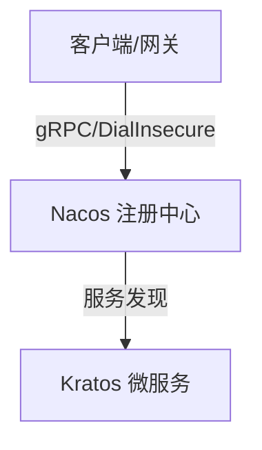

---
tags:
  - tech/growing
  - status/review
  - Lv2
date: 2026-05-30 18:09
anki-deck: ComputerScience::CloudNative
---
# 主题

> [!abstract] 场景与痛点 (Why)
> - **核心诉求：** 填入解决什么问题、应对什么业务场景
> - **前置上下文：** 填入依赖的服务或基础设施版本

---

## 核心架构 / 机制 (How)



### 生产环境约束与踩坑点
- [ ] **服务发现：**
- [ ] **资源限制：** 

---

## 配置与核心代码 (Code)

```go
package main

import "fmt"

func main() {
    // TODO: 完善业务逻辑
    fmt.Println("System initialized.")
}
```

---

## 记忆卡

TARGET DECK: ComputerScience::CloudNative 
START 
填空题 
1. 关于 **主题**，其核心机制在于：{{c1::填入核心机制}}。 
2. 当出现 {{c2::异常场景}} 时，系统表现为 {{c3::现象描述}}。 
FILE: 主题 
END 

START 
问答题 
Front: 主题 的核心用途是什么？ 
Back:
END

---

## 延伸阅读
* **归属主题索引：** [[微服务架构MOC]] / [[云原生基础设施]]
* **参考文档：**