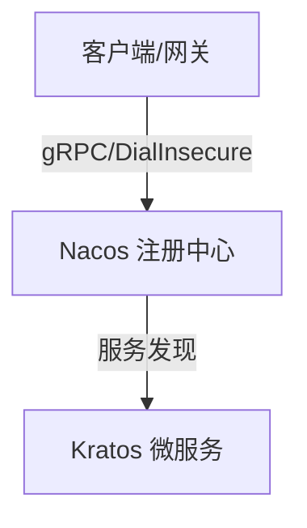

---
tags:
  - tech/growing
  - status/review
date: 2026-05-30 17:10
anki-deck: ComputerScience::Backend
---
# Untitled

> [!abstract] 场景与痛点 (Why)
> - **核心诉求：** 填入解决什么问题、应对什么业务场景
> - **前置上下文：** 填入依赖的服务或基础设施版本

---

## 核心架构 / 机制 (How)



### 生产环境约束与踩坑点
- [ ] **服务发现：** - [ ] **资源限制：** ---

## 配置与核心代码 (Code)

```go
package main

import "fmt"

func main() {
    // TODO: 完善业务逻辑
    fmt.Println("System initialized.")
}
```

---

## Anki 记忆卡片

> [!info] Anki 卡片配置区
> TARGET DECK: ComputerScience::Backend
> START
> Cloze
> 关于 **Untitled**，其核心配置/核心机制的关键在于：{==填入核心记忆点==}。
> FILE: Untitled
> END

---

## 延伸阅读
* **归属主题索引：** [[微服务架构MOC]] / [[云原生基础设施]]
* **参考文档：** ````

直接拿去用！按下 `Alt + N` 就能呼出超酷的牌组下拉菜单了。˜˜